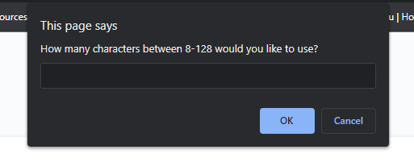
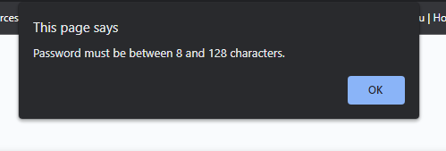
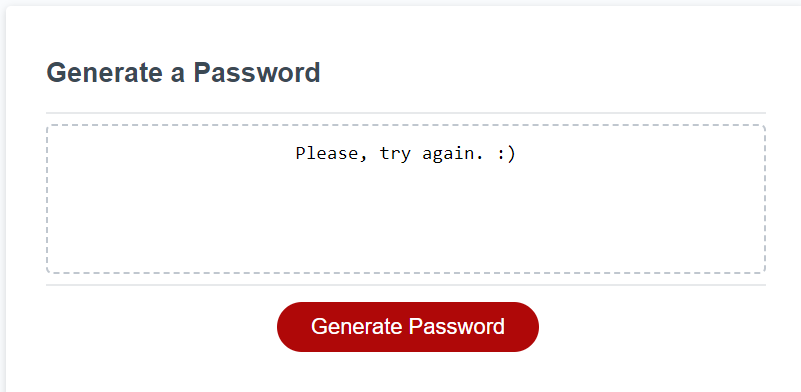

## Custom Password Generator

## Description

This page displays a custom password generator built using HTML, CSS and Javascipt. The page will generate a password based on the users selections when prompted with various questions.

## Table of Contents

- [Usage](#Usage)
- [Link to page](#Link)

## Usage

To use the custom password generator the user must first click the generate password button (example below):

;

The page will then present the user with a series of prompts. The first, to pick a number between 8-128. The second, to choose it they would like capital letters. The third, if they would like lower case letters. The fourth, if they would like special characters. And the last will ask if they would like numbers included in their password. 

Below is an example of what the first input prompt will look like:

;

Below is an example of what the following four prompts will look like:

;

Should the user choose a number outside of the peramiters set for character length or fail to select at least one character type, the page will inform them that they must select a number between 8-128 or choose at least one character type, depending on which one they did not complete correctly, and the following message will display in place of the generated password.

Once the user have properly answered the prompts, the text box will display a custom password based on their selections.

## Link to Live Custom Password Generator

To access this webpage, please click the link below:

